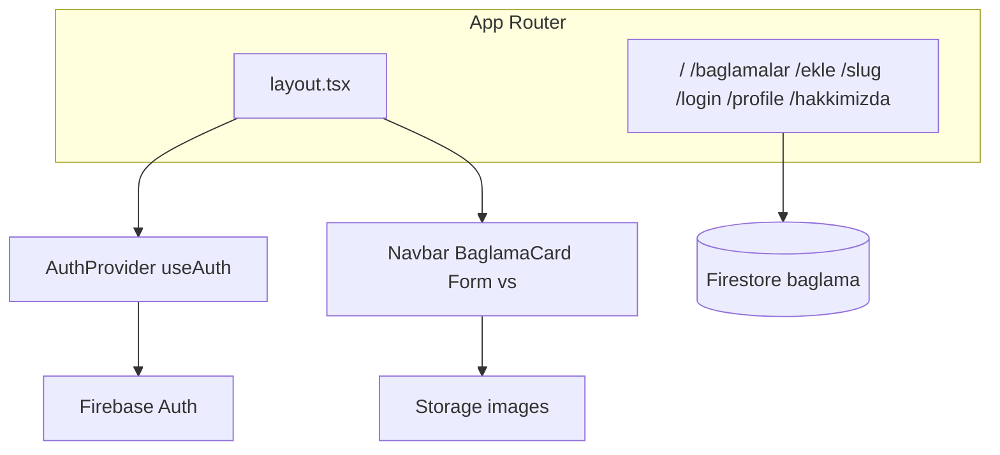

# Baglama Store — Yapı Dökümanı

Multi-tenant bağlama kataloğu / mağaza iskeleti. Next.js App Router ile arayüz, Firebase ile veri/depolama ve oturum yönetimi. Tenant branding ve Firebase projesi build-time seçilir; ayrıntılar için [docs/TENANTS.md](./docs/TENANTS.md).

## 1. Genel bakış

| Katman | Teknoloji |
|--------|-----------|
| Framework | Next.js `15.5` (App Router) + React 19 |
| Dil | TypeScript 5.9 |
| Veri | Firebase 12 (Firestore + Storage + Auth) |
| Oturum | Firebase Auth + `AuthProvider` / `useAuth` |
| UI | Ant Design 5.29, Tailwind CSS 3.4, Font Awesome 6.1.2 |

### Scripts (`package.json`)

| Komut | Açıklama |
|-------|----------|
| `npm run dev` | Geliştirme sunucusu |
| `npm run build` | Üretim derlemesi |
| `npm start` | Üretim sunucusu |
| `npm run lint` | ESLint |
| `npm run tenant:list` | Kayıtlı tenant’lar |
| `npm run tenant:use -- <id>` | Aktif tenant seç |
| `npm run dev:tenant -- <id>` | Tenant ile geliştirme |
| `npm run build:tenant -- <id>` | Tenant-izole build |

### Multi-tenant

Aktif tenant `NEXT_PUBLIC_TENANT_ID` + `lib/tenants/active.ts` (script üretir). Yeni tenant ekleme, env ve izole build: **[docs/TENANTS.md](./docs/TENANTS.md)**.

### Mimari



Hybrid routing yok: tüm UI `app/` altında. **Middleware yok** — rota koruması `AuthGuard` / `useAuth` ile istemci tarafında.

---

## 2. Dizin yapısı

```
baglama-store/
├── app/                         # App Router sayfalar ve root layout
│   ├── layout.tsx               # Navbar, AuthProvider, Ant Design registry
│   ├── globals.css              # Tailwind + global stiller
│   ├── page.tsx                 # Ana sayfa (/)
│   ├── baglamalar/
│   │   ├── page.tsx             # Liste
│   │   ├── ekle/page.tsx        # Yeni bağlama formu
│   │   └── [slug]/page.tsx      # Detay (SSG)
│   ├── login/page.tsx
│   ├── profile/page.tsx
│   └── hakkimizda/page.tsx
├── components/                  # İstemci UI bileşenleri
├── context/                     # AuthContext
├── lib/                         # Tipler, yardımcılar, tenants, theme
│   └── tenants/                 # Tenant registry + branding config
├── scripts/tenant.mjs           # Tenant use / izole build
├── .env.tenants/                # Tenant env şablonları (secret’lar gitignore)
├── public/tenants/              # Tenant logoları
├── assets/fontawesome-6.1.2/    # Vendored Font Awesome
├── firebase.config.ts           # Firebase init + veri katmanı
├── next.config.js
├── tailwind.config.ts
├── postcss.config.js
├── tsconfig.json                # @/* → proje kökü
└── package.json
```

| Yol | Rol |
|-----|-----|
| `app/` | Rotalar, layout, `globals.css` |
| `components/` | Yeniden kullanılan UI |
| `context/` | `AuthProvider` / `useAuth` |
| `lib/` | Tipler, form seçenekleri, slug, Ant Design StyleProvider |
| `lib/tenants/` | Tenant config + `active.ts` (script üretir) |
| `scripts/tenant.mjs` | Tenant seçimi ve izole build |
| `firebase.config.ts` | Firebase init + Firestore/Auth/Storage yardımcıları |
| `assets/fontawesome-6.1.2/` | Font Awesome CSS |

Path alias: `@/*` → proje kökü (`tsconfig.json`).

---

## 3. Rotalar

| Route | Dosya | Açıklama |
|-------|-------|----------|
| `/` | `app/page.tsx` | Ana sayfa (placeholder: “Merhaba”) |
| `/baglamalar` | `app/baglamalar/page.tsx` | Firestore’dan tüm bağlamalar; kart listesi |
| `/baglamalar/[slug]` | `app/baglamalar/[slug]/page.tsx` | Detay; `generateStaticParams` ile SSG; yoksa `notFound()` |
| `/baglamalar/ekle` | `app/baglamalar/ekle/page.tsx` | Bağlama ekleme formu |
| `/login` | `app/login/page.tsx` | Credentials giriş |
| `/profile` | `app/profile/page.tsx` | Oturum bilgisi + profil güncelleme |
| `/hakkimizda` | `app/hakkimizda/page.tsx` | Mağaza / hakkımızda (statik metin) |

### Layout

- Tek root layout: `app/layout.tsx`
- Metadata: aktif tenant `meta` alanından (`getTenant()`)
- Sıra: `StyledComponentsRegistry` → `AuthProvider` → `Navbar` + `NewButton` + `{children}`
- Nested layout yok
- `middleware.ts` yok

### Eksik rota

Navbar `/iletisim` linkine gidiyor; bu sayfa henüz tanımlı değil.

---

## 4. Bileşenler

| Bileşen | Dosya | Kullanıldığı yer | Rol |
|---------|-------|------------------|-----|
| `Navbar` | `components/Navbar.tsx` (+ `Navbar.css`) | Root layout | Logo, oturum/çıkış, mobil menü, nav linkleri |
| `NewBaglama` (`NewButton`) | `components/NewBaglama.tsx` | Root layout | Girişliyse FloatButton → `/baglamalar/ekle` |
| `BaglamaCard` | `components/BaglamaCard.tsx` | `/baglamalar` | Ant Design Card; slug ile detaya gider |
| `BaglamaForm` | `components/BaglamaForm.tsx` | `/baglamalar/ekle` | Form + Storage upload; `addBaglama` çağrısı şu an yorum satırında |
| `MyImages` | `components/MyImages.tsx` | `/baglamalar/[slug]` | Ant Design image preview grubu |
| `LoginForm` | `components/LoginForm.tsx` | `/login` | Credentials `signIn` |
| `ProfileForm` | `components/ProfileForm.tsx` | `/profile` | Firebase Auth `displayName` / `photoURL` |
| `SessionProvider` | `components/SessionProvider.tsx` | Root layout | `next-auth/react` SessionProvider sarmalayıcısı |

### `lib/` yardımcıları

| Dosya | İçerik |
|-------|--------|
| `lib/Interfaces.ts` | `Baglama` tipi |
| `lib/generalValues.ts` | Form seçenekleri: `boyut`, `tekneBoyu`, `tip`, `govdeAgaci` |
| `lib/genFunc.ts` | `modifyString` — başlığı slug’a çevirir (doc id / URL) |
| `lib/AntdRegistry.tsx` | Ant Design CSS-in-JS SSR (`StyleProvider`) |

Form seçenekleri (`generalValues`):

- **boyut:** Kısa Sap, Uzun Sap
- **tekneBoyu:** 35–49
- **tip:** Oyma, Yaprak
- **govdeAgaci:** Ardıç, Ceviz, Dut, Karaağaç, Kestane, Maun

---

## 5. Veri katmanı (Firebase)

Dosya: [`firebase.config.ts`](firebase.config.ts)

### Servisler

| Export | Servis |
|--------|--------|
| `app` | Firebase app (singleton) |
| `db` | Firestore |
| `storage` | Storage |
| `auth` | Auth |
| `firebaseConfig` | Config nesnesi |

Firebase proje id: `biladerler-muzik`. Config `NEXT_PUBLIC_*` ortam değişkenlerinden okunur (şablon: `.env.example`).

### Koleksiyonlar

| Koleksiyon | Doc ID | Not |
|------------|--------|-----|
| `baglama` | `modifyString(title)` (`setDoc`) | Ana katalog |
| `categories` | `modifyString(title)` | Yalnızca export edilmeyen `addCategory` kullanır |

### Fonksiyonlar

| Fonksiyon | Export | Davranış |
|-----------|--------|----------|
| `getBaglamalar()` | Evet | `baglama` koleksiyonunu okur → `Baglama[]` |
| `getBaglama(id)` | Evet | Tek doküman; yoksa `undefined` |
| `addBaglama(baglama)` | Evet | `baglama/{slug}` + `created_at: serverTimestamp()` |
| `updateMyProfile(values)` | Evet | `auth.currentUser` üzerinde `updateProfile` |
| `addCategory(title)` | Hayır | `categories/{slug}` — ölü kod |

Güncelleme/silme yardımcıları yok (`updateDoc` / `deleteDoc` import edilmiş ama kullanılmıyor).

### Storage

`BaglamaForm` dosyaları `images/{filename}` yoluna `uploadBytes` + `getDownloadURL` ile yükler.

### `Baglama` modeli (`lib/Interfaces.ts`)

```ts
interface Baglama {
  id: string;
  title: string;
  boyut: string;
  govdeAgaci: string;
  tekneBoyu: string;
  tip: string;
  description: string;
  youtubeLink: string;
  images: string[];
  fiyat: number;
  created_at?: any; // okumada Timestamp.seconds
}
```

### Slug tutarlılığı

Liste kartları `modifyString(title)` ile gezer; detay ve `generateStaticParams` Firestore `doc.id` kullanır. Bunlar yalnızca doküman id’leri slug’lanmış başlık olarak oluşturulduğunda (`addBaglama` gibi) uyumludur.

### Veri akışı

```
/baglamalar          ──getBaglamalar()──►  Firestore baglama/*
/baglamalar/[slug]   ──getBaglama(id)──►  Firestore baglama/{id}

/baglamalar/ekle     ──uploadBytes──────►  Storage images/*
                 (addBaglama yorumlu)     Firestore baglama/*

/login ──signIn(credentials)──► NextAuth ──► Firebase Auth
                                      │
                                      ▼
                               SessionProvider → Navbar / NewButton / Profile
```

---

## 6. Auth akışı

### Kaynak: Firebase Auth + React Context

Tek kaynak doğruluk: tarayıcıdaki Firebase Auth. `onAuthStateChanged` ile oturum `AuthProvider` içinde tutulur.

| Parça | Dosya |
|-------|-------|
| Provider / hook | `context/AuthContext.tsx` → `AuthProvider`, `useAuth` |
| Rota koruması | `components/AuthGuard.tsx` |
| Layout | `app/layout.tsx` → `AuthProvider` |

### API (`useAuth`)

- `user` — Firebase `User \| null`
- `loading` — ilk `onAuthStateChanged` sonucu beklenirken `true`
- `login(email, password)` — `signInWithEmailAndPassword`
- `logout()` — `signOut`
- `updateUserProfile({ displayName, photoURL })` — `updateProfile` + reload

### Akış

1. `/login` → `LoginForm` → `login()` (istemci Firebase Auth)
2. `onAuthStateChanged` → Context `user` güncellenir
3. Navbar / FloatButton / AuthGuard `useAuth` ile tepki verir
4. `logout()` oturumu kapatır; korumalı sayfalar `/login`’e yönlendirir

Not: NextAuth kaldırıldı; oturum yalnızca Firebase Auth + Context üzerinden yönetilir.

---

## 7. Stil ve config

### Stil katmanları

| Katman | Detay |
|--------|-------|
| Tailwind | `tailwind.config.ts`; `preflight: false` (Ant Design çakışmasını önlemek için); `theme` bg `#001529` |
| Global CSS | `app/globals.css` — Tailwind layers, font importları |
| Ant Design 5 | Form, Card, Button, FloatButton, Image; SSR: `@ant-design/cssinjs` |
| Navbar CSS | `components/Navbar.css` — sticky nav, hamburger |
| Font Awesome | `assets/fontawesome-6.1.2/`; layout’ta `all.min.css` |
| next/font | Inter (`app/layout.tsx`) |

### `next.config.js`

Uzak görseller için `images.remotePatterns`:

- `avatars.githubusercontent.com`
- `m.media-amazon.com`
- `imageupload.io`
- `eksiup.com`

### Ortam değişkenleri

Kurulum: `.env.example` → `.env` kopyala. `.env` gitignore’dadır; repoda yalnızca `.env.example` tutulur.

| Değişken | Kullanım |
|----------|----------|
| `NEXT_PUBLIC_API_KEY` | Firebase API key |
| `NEXT_PUBLIC_AUTH_DOMAIN` | Firebase auth domain |
| `NEXT_PUBLIC_PROJECT_ID` | Firebase project id |
| `NEXT_PUBLIC_STORAGE_BUCKET` | Firebase storage bucket |
| `NEXT_PUBLIC_MESSAGING_SENDER_ID` | Firebase messaging sender id |
| `NEXT_PUBLIC_APP_ID` | Firebase app id |

Kaynak: `firebase.config.ts` → `process.env.NEXT_PUBLIC_*`

---

## 8. Bilinen boşluklar / teknik borç

1. Ana sayfa (`/`) placeholder
2. `BaglamaForm` içinde `addBaglama` çağrısı yorum satırında — görsel yüklenir, Firestore’a yazılmaz
3. `/iletisim` Navbar’da var, sayfa yok
4. Firebase adapter paketleri kullanılmıyor
5. Route koruması için `middleware` yok
6. Bağlama update/delete API’si yok
7. `addCategory` export edilmiyor / UI’da kullanılmıyor

---

## 9. Hızlı referans — dosya → sorumluluk

| Dosya | Sorumluluk |
|-------|------------|
| `app/layout.tsx` | Shell, session, navbar, float buton |
| `firebase.config.ts` | Firebase + CRUD okuma/yazma |
| `pages/api/auth/[...nextauth].ts` | Auth providers |
| `lib/Interfaces.ts` | `Baglama` tipi |
| `lib/genFunc.ts` | Slug üretimi |
| `lib/generalValues.ts` | Form enum/seçenek listeleri |
| `components/BaglamaForm.tsx` | Ekleme + Storage upload |
| `components/BaglamaCard.tsx` | Liste kartı / navigasyon |
